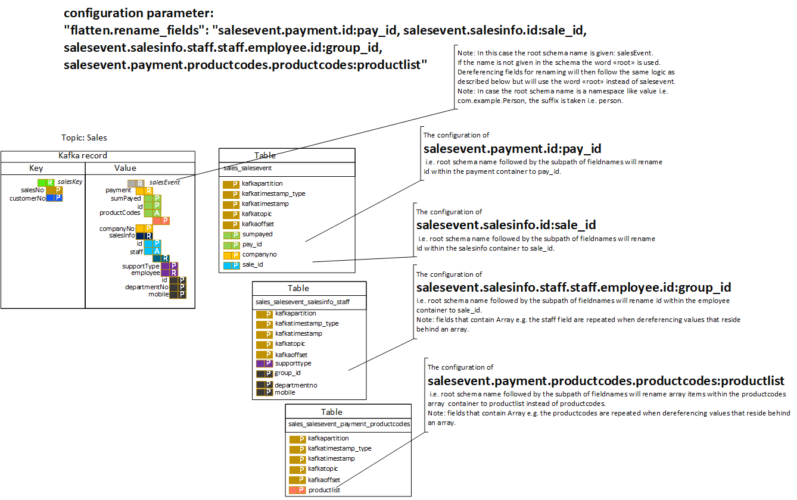

# Kafka Connect JDBC Connector merged with Flatten feature

kafka-connect-jdbc-flatten is a [Kafka Connector](http://kafka.apache.org/documentation.html#connect)
for loading data to and from any JDBC-compatible database with a flatten feature that can be activated with 
config parameter "flatten": "true". Map and array structures are with this feature dereferenced and written to
their own target tables.

The connector extends the Confluent jdbc sink connector:
https://github.com/confluentinc/kafka-connect-jdbc

##Config parameters:
The following lists configuration options of the connector that are in addition to the configuration parameters listed at
https://www.confluent.io/hub/confluentinc/kafka-connect-jdbc.

## flatten
default `false`

    

    Whether to automatically flatten arrays or maps and write their values to seperate
    destination tables based on array/map value schema.

## flatten.coordinates
default `false`

    

    Whether to store topic, partition, offset in each of the target tables when flatten is enabled. 
    This can be handy to join data from several target tables that belong to the same record.

## flatten.coordinates.fields
default `kafkatopic, kafkapartition, "kafkaoffset, kafkatimestamp, kafkatimestamp_type`

    

     List of comma-separated kafka metadata field names. If empty, 
     the defaults: kafkatopic, kafkapartition, kafkaoffset, 
     kafkatimestamp, kafkatimestamp_type will be used. Note that flatten.coordinates must be set to true 
     to propagate the record metadata to the sink. 

## flatten.delimiter
default `_`

    

     Symbol used to concatenate flattened record fields and table names when flatten is enabled.
     By default "_" will be used. 

## flatten.rename_fields
default ` `

    

     Whether to rename fields when flattening is enabled with enlisted mapping pairs <original name>:<new name>.
     The original name of the fields are to be referenced by: suffix of root schema name (if absent the word root is used),
     followed by the subpath of fieldnames.
     All of these are to be seperated by dot ('.').
     
## flatten.rename_tables
default ` `

    

     Whether to rename tables with enlisted mapping pairs <original name>:<new name>.
     Original table names are specified as topic name, followed by the 
     suffix of the root schema name (if absent the word root is used), 
     followed by the subpath of the field paths
     within the hierarchical value structure.
     All of these are to be seperated by the configured flatten.delimiter (default '_'). 
     

## flatten.uppercase
default `false`

    

     Whether to automatically apply uppercase to column names and table names when flatten is enabled.
     When set to false, lowercase will be applied.

## flatten.containers.whitelist
default ` `

    

     List of comma-separated container paths. If empty, all containers and subcontainers are 
     utilized, otherwise used to filter to the desired containers within the hierarchical value structure.
     The containers are to be referenced by: suffix of root schema name (if absent the word root is used), 
     followed by the subpath of fieldnames that lead to the container that is to be whitelisted.
     All of these are to be seperated by dot ('.')."
     
## flatten.instruction_cache_size
default `100`

     Size of instruction cache needed for flattening Connect schema into subschemas. Cache maintains a mapping between 
     Connect Schema and instructions to flatten these to subschemas and substructures. 

## pk.mode
default `none`

     With mode flatten, field(s) from the record key and record value can be specified in:
     - flatten.pk_propagate_value_fields: Fields from the record value that match are to be propagated down to each target table
     and shall be constrained as (composed) primary key.
     - pk.fields: 
     Fields from the record key that match are to be propagate down to each target table and shall be constrained as
     (composed) primary key.
     Fields from the record value that match are NOT to be propagate down to each target table but shall be constrained as
     (composed) primary key in the specific target table.
     
## pk.fields
default ` `

     When pk.mode is set to "flatten", all fields from the key struct and value struct that match will be used.
     Fields from the record key that match are to be propagate down to each target table and shall be constrained as
     (composed) primary key.
     Fields from the record value that match are NOT to be propagate down to each target table but shall be constrained as
     (composed) primary key in the specific target table."
     
     The fields are to be referenced by: suffix of root schema name (if absent the word root is used), 
     followed by the subpath of fieldnames.
     All of these are to be seperated by dot ('.').
     e.g.
     A record with a key that contains a structure which carries a name com.example.personkey with a field named
     keyInt that is configured as primary key.
     A value that contains a main structure which carries a name com.example.person and within it 
     a field named address that contains an array with within it a field named street. 
     "person.address.address.street, personkey.keyint"
     
     In case the key schema is not a structure but a primitive it is referenced as:
     suffix of root schema name (if absent the word root is used) + "." + "key"
     
 
## flatten.pk_propagate_value_fields
default ` `

     When pk.mode is set to "flatten", this configuration is used as a ist of comma-separated primary key field paths.
     Listed fields will propagate down to any flattened subcontainers lower in the hierarchy path as primary key.
     Fields behind arrays are referenced by repeating the field name of the field that contains the array.
     The fields are to be referenced by: suffix of root schema name (if absent the word root is used), 
     followed by the subpath of fieldnames.
     All of these are to be seperated by dot ('.').
     
     e.g. "mainrecord.fieldnameXinMainstruct, mainrecord.array2.array2.fieldnameYinStructBehindArray, 
     mainrecord.record2.array3.array3.fieldnameZinStructBehindArrayBehindStruct"

## delete.enabled
default `false`

     Whether to treat null record values as deletes. 
     Requires flatten as pk.mode and a unique field from the record key to be configured in pk.fields.

# License

This project is licensed under the [Confluent Community License](LICENSE).
